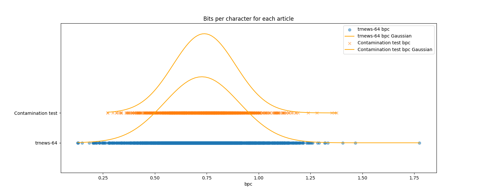
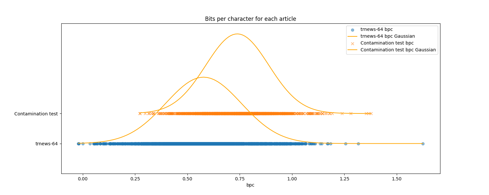

# Turkish LLM trnews-64 bpc evaluation package

This package is aimed to evaluate the BPC of a Turkish language model on trnews-64 and wikitext-2 datasets. It also includes a contamination test to check if the model's training data is contaminated with trnews-64.

## Requirements

- Python 3.8 or later
- PyTorch>=1.12 or Flax>=0.7.0
- Transformers>=4.11.3  

## 1. Evaluate BPC on trnews-64

```bash
python evaluate_bpc.py --batch_size [batch_size] --model [model_path]
```

Example:

```bash
python evaluate_bpc.py --batch_size 8 --model asafaya/kanarya-750m
```

Expected output:

```
PyTorch is not installed.
Flax is installed, running with Flax.
Loading asafaya/kanarya-750m...
<class 'transformers.models.gptj.modeling_flax_gptj.FlaxGPTJForCausalLM'> with vocab_size=32768
Loading trnews-64.test.raw...
Read 4033 articles from trnews-64.test.raw
Tokenizing...
Got 1409470 tokens from 6939922 chars
Got 505 batches with batch_size=8
tokenizer encodes 4.9237812794880345 chars per token.
Calculating NLL: 100%|███████████████████| 505/505 [02:55<00:00,  2.88batch/s]
Summary:
model	= asafaya/kanarya-750m
ntokens	= 1409470
nchars	= 6939922
nvocabs	= 32768
sum_nll	= 3686108.0
tkn_ppl	= 13.670551966936314
bpc	= 0.7662809080247783
```

## 2. Evaluate BPC on wikitext-2

```bash
python evaluate_bpc.py --batch_size 8 --model asafaya/kanarya-750m --wikitext
```

Expected output:

```
PyTorch is not installed.
Flax is installed, running with Flax.
Loading asafaya/kanarya-750m...
<class 'transformers.models.gptj.modeling_flax_gptj.FlaxGPTJForCausalLM'> with vocab_size=32768
Loading wikitext-2.test.raw...
Read 1828 articles from wikitext-2.test.raw
Tokenizing...
Got 442170 tokens from 1205161 chars
Got 229 batches with batch_size=8
tokenizer encodes 2.725560304860122 chars per token.
Calculating NLL: 100%|█████████████████| 229/229 [01:20<00:00,  2.83batch/s]
Summary:
model	= asafaya/kanarya-750m
ntokens	= 442170
nchars	= 1205161
nvocabs	= 32768
sum_nll	= 895700.0
tkn_ppl	= 7.581351456141901
bpc	= 1.0722400974842736
```

## 3. Running Contamination test

This is aimed to test if the model's training data is contaminated with trnews-64.

1) Generate a new dataset from turkish news resources.

First you need to install `trafilatura` package. You can install it via pip: 

```bash
pip install trafilatura
```

Then run the following command to generate a new dataset from turkish news resources:

```bash
python prepare_cont_data.py
```

This will generate a file named `trnews.cont.raw`.

2) Run bpc on trnews-64 and the new dataset and save individual bpc values

```bash
python evaluate_bpc.py --batch_size 1 --model asafaya/kanarya-750m --save_bpc trnews-64.bpc
python evaluate_bpc.py --batch_size 1 --model asafaya/kanarya-750m --contamination trnews.cont.raw --save_bpc trnews-cont.bpc
```

3) Compare the bpc values and their distributions using `visualize.py`:

```bash
python visualize.py trnews-64.bpc trnews.cont.bpc
```

When you run the `visualize.py` command, it will generate a plot showing the distribution of bpc values for trnews-64 and the new dataset. If the two distributions are significantly different, it means that the model's training data is contaminated with trnews-64.

When we run this test with `asafaya/kanarya-750m` model, we get the following plot:



An example of a contamination case can be shown in the following plot:

